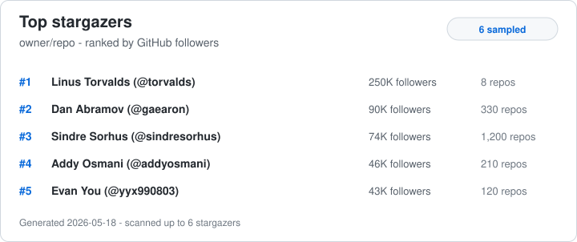

# Starproof

Generate README-friendly SVGs that show who starred a repository, not just how many people starred it.

The hosted version is meant to be a one-line README embed:

```md

```

The more opinionated mode is **Superstars**: a curated list of prominent tech and open source accounts. The badge checks whether any of those accounts appear among the sampled stargazers.

```md

```

With options:

```md


```

## Run The Hosted Badge Locally

```sh
npm run serve
```

Then open:

```text
http://localhost:3000/owner/repo.svg?demo=1
http://localhost:3000/owner/repo/superstars.svg?demo=1
```

For a real repo, set a GitHub token and request `/owner/repo.svg`:

```sh
GITHUB_TOKEN=github_pat_xxx npm run serve
```

```md

```

Supported URL options:

```text
limit=6
maxStargazers=500
minFollowers=0
theme=light|dark
excludeBots=1
mode=top|superstars
demo=1
```

The server caches rendered cards in memory. Set `CACHE_TTL_SECONDS` to tune the cache duration. Set `PORT` to change the HTTP port.

## Superstars

The curated list lives in [`data/superstars.json`](./data/superstars.json). Each entry has a GitHub login, display name, and a short blurb that can appear in the SVG.

Superstar badges may include profile links and avatar images in the raw SVG. In GitHub README Markdown, SVGs are embedded as images, so internal links are usually not clickable and external avatar images may depend on the renderer. The text-only fallback remains the important part.

See [`SUPERSTARS.md`](./SUPERSTARS.md) for how to suggest list additions, removals, blurbs, or a better name than "Superstars."

## Deploy

This repo includes a `Dockerfile` and `render.yaml`, so the quickest deploy path is Render:

1. Create a new Render Blueprint from this repo.
2. Add `GITHUB_TOKEN` as a secret environment variable.
3. Deploy.
4. Embed `https://your-service.onrender.com/owner/repo.svg` in a README.

Any Docker host works too:

```sh
docker build -t top-stargazers-card .
docker run -p 3000:3000 -e GITHUB_TOKEN=github_pat_xxx top-stargazers-card
```

## CLI Mode

```sh
npx top-stargazers-card --repo owner/repo --output top-stargazers.svg
```

For local development in this repo:

```sh
node ./bin/top-stargazers-card.mjs --repo owner/repo --output top-stargazers.svg
```

Use a GitHub token for realistic repos. Without one, GitHub's unauthenticated API limit is very small.

```sh
GITHUB_TOKEN=ghp_xxx node ./bin/top-stargazers-card.mjs --repo owner/repo
```

## Options

```sh
node ./bin/top-stargazers-card.mjs \
  --repo owner/repo \
  --output top-stargazers.svg \
  --limit 8 \
  --max-stargazers 1000 \
  --min-followers 50 \
  --exclude-bots \
  --mode superstars \
  --theme dark
```

`--max-stargazers` controls how many stargazers are sampled before ranking. GitHub's REST stargazer endpoint returns pages in API order, so this first version is best understood as "top followed among the sampled stargazers," not a full census unless you set the sample high enough.

## GitHub Actions

Most users should prefer the hosted badge. The workflow below is for repos that want to generate and commit their own `top-stargazers.svg` instead of relying on a third-party image URL.

Add this workflow to `.github/workflows/update-top-stargazers.yml`:

```yaml
name: Update top stargazers

on:
  workflow_dispatch:
  schedule:
    - cron: "17 3 * * *"

permissions:
  contents: write

jobs:
  update:
    runs-on: ubuntu-latest
    steps:
      - uses: actions/checkout@v4
      - uses: actions/setup-node@v4
        with:
          node-version: 22
      - run: node ./bin/top-stargazers-card.mjs --repo "$GITHUB_REPOSITORY" --output top-stargazers.svg --limit 8 --max-stargazers 1000 --exclude-bots
        env:
          GITHUB_TOKEN: ${{ secrets.GITHUB_TOKEN }}
      - uses: stefanzweifel/git-auto-commit-action@v5
        with:
          commit_message: "Update top stargazers card"
          file_pattern: top-stargazers.svg
```

Then embed it:

```md

```

## Demo

Render a no-network demo card:

```sh
node ./bin/top-stargazers-card.mjs --demo --repo owner/repo --output top-stargazers.svg
```

## Notes

Follower count is a signal, not a proof of authenticity. The useful next step is a composite score that also weighs account age, contribution activity, repositories maintained, stars earned, org membership, and whether accounts arrive in suspicious bursts.
